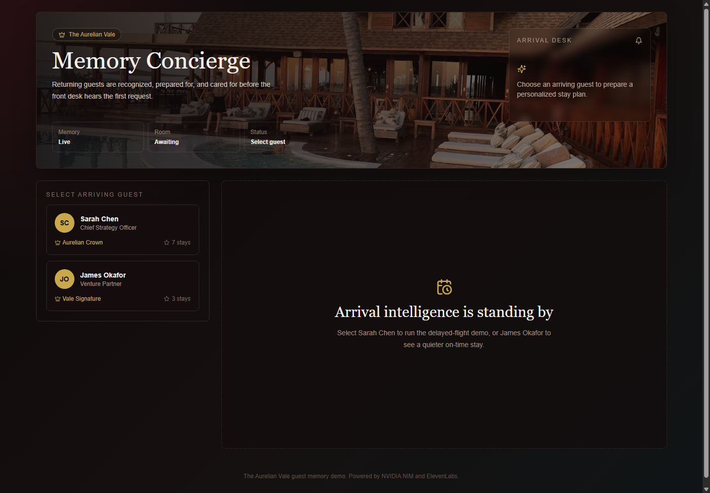

# Memory Concierge

[](https://github.com/abhilashreddychitiki/Memory-Concierge/actions/workflows/build.yml)


[](https://github.com/abhilashreddychitiki/Memory-Concierge/stargazers)

**Memory Concierge** is an AI-powered luxury hotel concierge prototype for **The Aurelian Vale**, a fictional grand hotel. It remembers returning guests, prepares their stay from past preferences, and adapts the guest experience when real-time events occur.

The core idea: guests should not have to repeat themselves every time they stay. The concierge should already remember.

[Live Demo](https://memory-concierge.vercel.app/) | [GitHub Repo](https://github.com/abhilashreddychitiki/Memory-Concierge)



## Why I Built This

I wanted to build an AI project that felt like a real workflow, not just another chatbot.

Hotels already know a lot about returning guests: preferred room temperature, pillow type, dietary restrictions, favorite drinks, daily routines, past celebrations, and arrival details. But in practice, that memory is often scattered or underused.

Memory Concierge explores what happens when AI turns guest memory into proactive service. Instead of waiting for a guest to ask for the same things again, the system helps staff prepare the stay, adapt to changes, and communicate in a warm, personal way.

## What It Does

- Select an arriving guest from a staff-facing dashboard.
- Generate a personalized welcome using guest history and preferences.
- Show room preparation details such as temperature, pillow type, wine, and amenities.
- Create a tomorrow morning brief based on routines and meetings.
- Simulate real-time events like delayed flights, dietary changes, quiet-room requests, and dinner delays.
- Generate staff actions and a guest-facing SMS-style message.
- Convert the welcome message into audio using ElevenLabs text-to-speech.

## Demo Story

The best demo guest is **Sarah Chen**, a returning guest whose flight is delayed by two hours.

The concierge already knows Sarah prefers a high-floor city-view room, 68 F room temperature, firm pillows, Burgundy Pinot Noir, sparkling water, and a yoga mat. When her flight delay is selected, the app generates an updated stay plan and a calm message for the guest.

This demonstrates the main product idea: proactive hospitality powered by memory.

## How I Used AI

AI was used in two ways:

1. **Development support:** I used Codex to help scaffold the app, debug build issues, refine the UI, update branding, and generate project documentation.
2. **Runtime product behavior:** The app uses NVIDIA NIM with `meta/llama-3.1-70b-instruct` to generate structured JSON for the concierge dashboard.

The app does not ask the model for one big paragraph. It asks for specific JSON fields like:

```json
{
  "welcome_message": "...",
  "room_status": "...",
  "dinner_note": "...",
  "tomorrow_brief": "...",
  "concierge_note": "..."
}
```

That makes the AI output easier to render reliably in the UI.

## Tech Stack

- **Framework:** Next.js 14 App Router
- **Language:** TypeScript
- **Styling:** Tailwind CSS
- **Animation:** Framer Motion
- **Icons:** Lucide React
- **LLM:** NVIDIA NIM through the OpenAI-compatible SDK
- **Model:** `meta/llama-3.1-70b-instruct`
- **Voice:** ElevenLabs text-to-speech
- **Data:** Local JSON guest profiles

## Architecture

```txt
app/
  api/
    adapt/route.ts      Generates real-time stay adaptations
    voice/route.ts      Converts welcome text to audio
    welcome/route.ts    Generates personalized welcome JSON
  globals.css
  layout.tsx
  page.tsx

components/
  AlertBanner.tsx
  DashboardHeader.tsx
  GuestSelector.tsx
  ItineraryCard.tsx
  MemoryTimeline.tsx
  RoomReadyCard.tsx
  TriggerPanel.tsx
  VoiceButton.tsx

data/
  guests.json

lib/
  elevenlabs.ts
  json.ts
  openai.ts
```

## API Flow

```txt
Guest selected
  -> POST /api/welcome
  -> NVIDIA Llama model returns structured JSON
  -> Dashboard renders welcome, room, dinner, brief, and memory note

Real-time event selected
  -> POST /api/adapt
  -> NVIDIA Llama model returns alert, actions, and guest message
  -> Dashboard renders updated stay plan

Play Welcome clicked
  -> POST /api/voice
  -> ElevenLabs returns MP3 audio
  -> Browser plays the concierge welcome
```

## Getting Started

Install dependencies:

```bash
npm install
```

Create a local environment file:

```bash
cp .env.local.example .env.local
```

Add your API keys:

```env
NVIDIA_API_KEY=your_nvidia_api_key_here
ELEVENLABS_API_KEY=your_elevenlabs_api_key_here
```

Run the development server:

```bash
npm run dev
```

Open:

```txt
http://localhost:3000
```

## Scripts

```bash
npm run dev
npm run build
npm run start
```

## Roadmap

- Add a short demo GIF showing guest selection and real-time adaptation.
- Add more guest profiles and stay scenarios.
- Add schema validation for model responses.
- Add a staff approval step before guest messages are sent.
- Add real flight-status integration.
- Add database-backed guest memory.
- Add authentication and staff roles.
- Add audit logs for AI-generated actions.
- Add multilingual concierge responses.
- Add test coverage for API routes and UI states.

## What I Learned

The biggest lesson was that AI feels more useful when it is placed inside a clear workflow. A model response becomes much more reliable when it has:

- A specific role.
- Narrow context.
- Structured output.
- A UI that knows exactly where each field belongs.

Memory Concierge is not just a chatbot with hotel-themed prompts. It is a small example of AI as a workflow layer: read context, reason over it, return structured output, and help a human act faster.

## Star The Project

If you like the idea or want to follow future improvements, please consider starring the repo:

[Star Memory Concierge on GitHub](https://github.com/abhilashreddychitiki/Memory-Concierge)

## License

This project is licensed under the MIT License.
